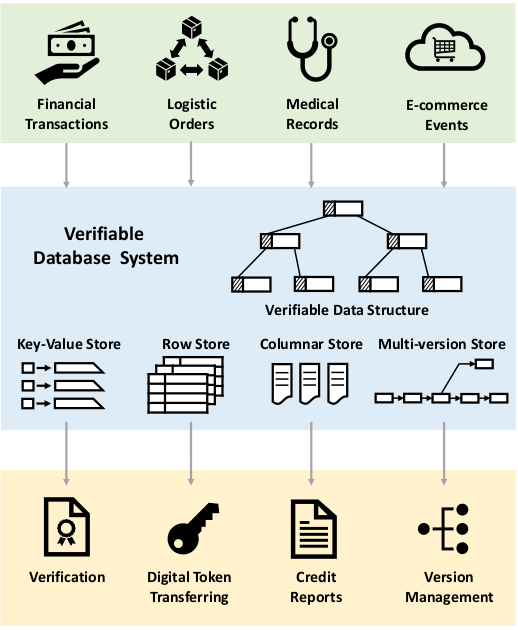
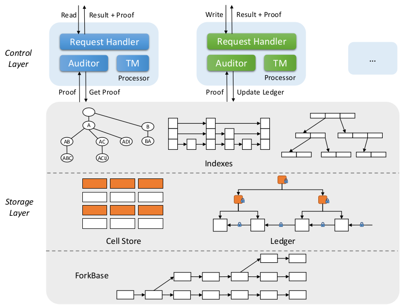

# Spitz
[English]() | [中文]()
## Overview
Spitz is a verifiable database system, which targets on businesses involving mutually distrustful or malicious parties. Spitz protects integrity of the data, of its provenance, and of its query execution. More specifically, any tampering such as changing the data content, changing a historical record, or modifying query results, can be detected. We note that the demand for verification is on the rise due to the requirements imposed by the regulators on various business sectors, investment and banking in particular.

Spitz is immutable, data cannot be modified or deleted once committed; transparent, all history data can be accessed efficiently; verifiable, fast verification is facilitated with proposed authentication data structure (ADS); and scalable, it scales to large number of nodes.

## Architecture

The control layer consists of multiple processor nodes that accept and process requests from a global message queue. Each node has three main components: a request handler, an auditor, and a transaction manager (TM). The request handler accepts query requests and returns the results with the corresponding proofs. The auditor communicates with the ledger in the storage layer to keep track of data changes. The transaction manager controls the execution of the queries in the storage.

The storage layer features a distributed storage engine, namely ForkBase. Built on top of ForkBase is a virtual cell store, as opposed to row or column store in traditional databases. The system maps each cell to a universal key consisting of the column id, primary key, timestamp, and the hash of its value. There are multiple index structures built into the storage layer to support verifiable query processing.

Ledger: this structure consists of a sequence of hashed blocks. Each block tracks the modification of the records, query statements, metadata and the root node of the indexes on the entire dataset. The integrity of ledger must be guaranteed.

Index: Spitz uses B^+-tree with ADS which offers efficient query and verification.

Inverted index: inverted index is used with ADS to provide fast processing of analytic queries.

## Publications
M. Zhang, Z. Xie, C. Yue, Z Zhong. “Spitz: A Verifiable Database System” Proceedings of the VLDB Endowment, 2020

C. Yue. Z. Xue, M. Zhang, G. Chen, B. C. Ooi, S. Wang, X. Xiao. “Analysis of Indexing Structures for Immutable Data” ACM International Conference on Management of Data (SIGMOD), 2020

S. Wang, T. T. A . Dinh, Q. Lin, Z. Xie, M. Zhang, Q. Cai, G. Chen, B.C. Ooi and P. Ruan. “ForkBase: An Efficient Storage Engine for Blockchain and Forkable Applications” Proceedings of the VLDB Endowment, 2018