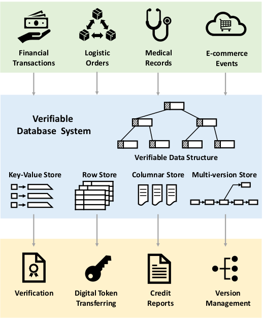
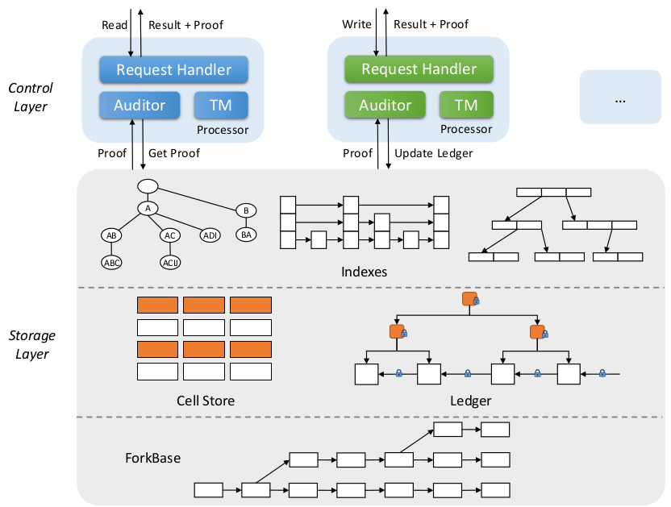

# Spitz
[English](README.md) | [中文](README_zh.md)
## 概述
Spitz是一个可信数据库系统，它用于为互不信任的组织在商务交易中提供保障，以及防范恶意组织。
Spitz可以为数据、数据来源以及查询操作的完整性提供保证。
具体来说，任何的篡改包括：修改数据内容，修改历史记录，或修改查询结果都会被检测到。
我们注意到：由于监管部门对各行各业，尤其是投资行业和银行提出了更加严格的要求，因此他们对于审查的需求日益增加。

Spitz中的数据具有以下特点：(1) 不变性，一旦提交就不能被修改或删除；(2) 透明性，所有的历史数据可以被高效访问；(3) 可信性，基于验证数据结构(ADS)，系统可以完成快速的验证；(4) 可扩展性，它可以扩展到大量节点。

## 系统架构

控制层由多个处理器节点组成，这些节点接受和处理来自全局消息队列的请求。每个节点包含三个主要组件：请求处理程序，审计程序和事务管理器(TM)。请求处理程序接受查询请求并返回查询结果及其对应证明。审计程序与存储层中的总账进行通信以跟踪数据变化。事务管理器控制存储中查询的执行。

存储层使用了一个分布式存储引擎，名为ForkBase。与传统数据库中的行或列存储不同，ForkBase顶部构建了一个虚拟单元存储。系统将每个单元格映射到一个由列ID，主键，时间戳及其值的散列值组成的通用键。存储层还内置了多种索引结构，以支持可验证的查询处理。

**总账：** 这种结构由一系列散列块组成。每个块跟踪整个数据集上记录，查询语句，元数据和索引根节点的修改。必须保证分类账的完整性。

**索引：** Spitz使用带有ADS的B+树作为索引结构，可以提供高效的查询和验证功能。

**待排索引：** 倒排索引与ADS一起使用，可以提供快速的分析查询处理。

## 发表论文
+ M. Zhang, Z. Xie, C. Yue, Z Zhong. [“Spitz: A Verifiable Database System”](https://www.comp.nus.edu.sg/~dbsystem/download/meihui-VLDB20-verification-paper.pdf) Proceedings of the VLDB Endowment, 2020

+ C. Yue. Z. Xue, M. Zhang, G. Chen, B. C. Ooi, S. Wang, X. Xiao. [“Analysis of Indexing Structures for Immutable Data”](https://arxiv.org/pdf/2003.02090.pdf) ACM International Conference on Management of Data (SIGMOD), 2020

+ S. Wang, T. T. A . Dinh, Q. Lin, Z. Xie, M. Zhang, Q. Cai, G. Chen, B.C. Ooi and P. Ruan. [“ForkBase: An Efficient Storage Engine for Blockchain and Forkable Applications”](http://www.vldb.org/pvldb/vol11/p1137-wang.pdf) Proceedings of the VLDB Endowment, 2018